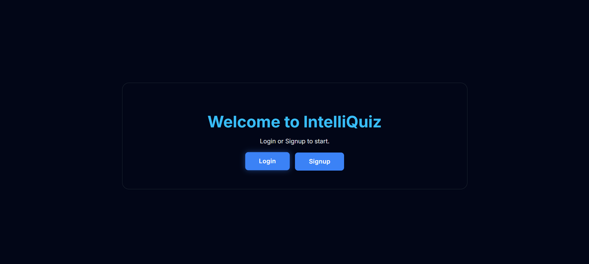
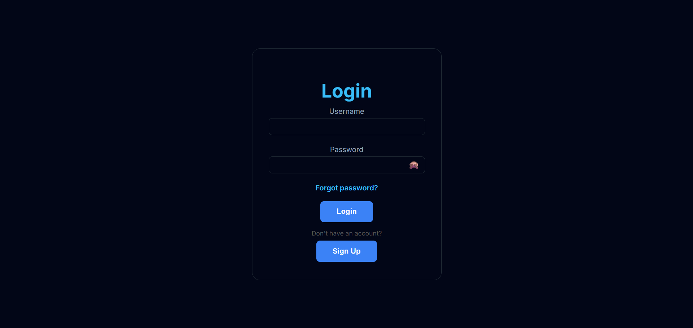
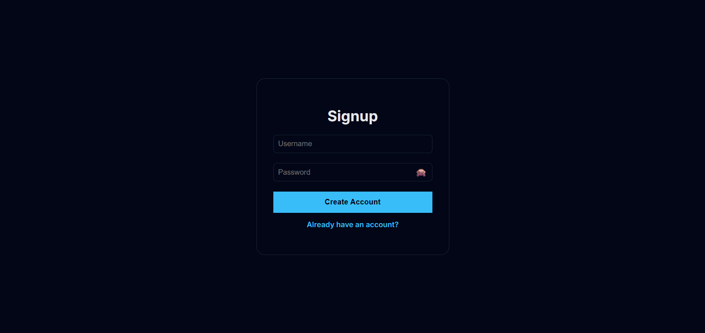
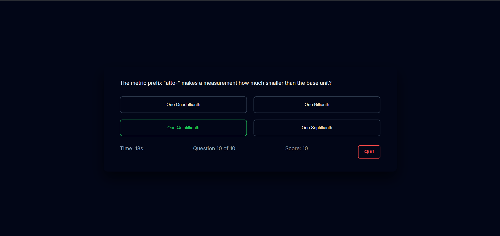
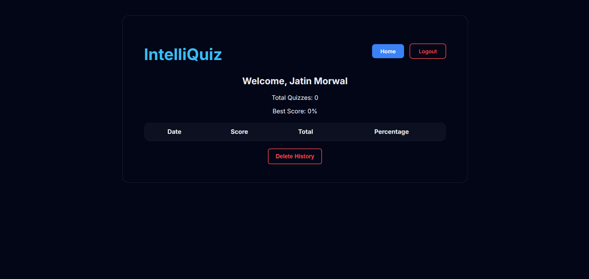
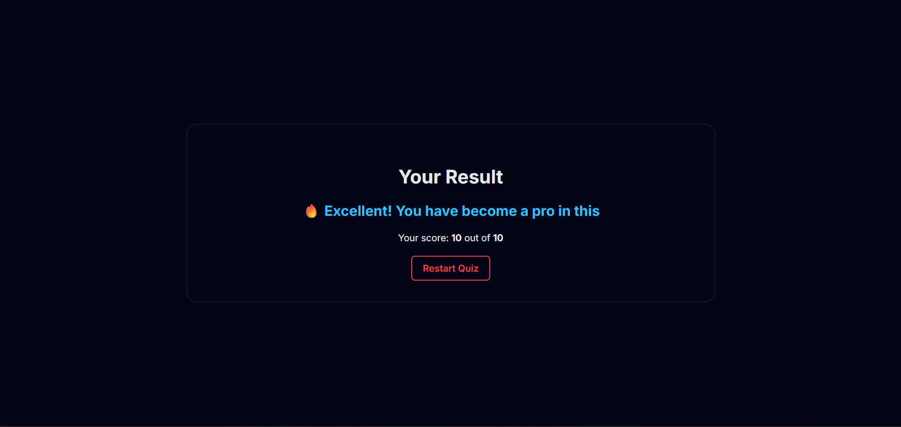

# Quiz Flask App

A full‑stack, interactive quiz application built with **Flask** and **MySQL**, featuring secure authentication, dynamic quizzes, result tracking, and persistent user history. The project is deployed on **Railway** and designed to be resume‑ and internship‑ready.

🌐 **Live Demo**
👉 [https://web-production-79f7d.up.railway.app](https://web-production-79f7d.up.railway.app)

---

## 🔥 Features

* User signup, login, logout
* Secure password hashing using Werkzeug
* Dynamic quiz questions (Open Trivia API)
* Score calculation with result feedback
* Quiz history tracking for logged‑in users
* Forgot password & delete account functionality
* Session management
* Responsive UI with Bootstrap

---

## 🧠 Tech Stack

| Technology | Description                |
| ---------- | -------------------------- |
| Python     | Backend logic              |
| Flask      | Web framework              |
| MySQL      | Database (Railway + Local) |
| HTML / CSS | Frontend                   |
| Bootstrap  | Responsive UI              |
| JavaScript | Quiz logic & API calls     |
| Gunicorn   | Production WSGI server     |
| Railway    | Deployment platform        |

---

## 📁 Project Structure

```
quiz_flask_app/
│
├── app.py
├── requirements.txt
├── Procfile
├── .env.example
├── db/
│   └── schema.sql
├── static/
│   ├── css/
│   │   └── style.css
│   ├── js/
│   │   └── app.js
│   └── favicon/
│       └── intelliquiz-favicon.svg
├── templates/
│   ├── welcome.html
│   ├── signup.html
│   ├── login.html
│   ├── index.html
│   ├── quiz.html
│   ├── result.html
│   ├── history.html
│   └── forgot-password.html
└── screenshots/
```

---

## 🚀 Local Installation & Setup

### 1️⃣ Clone the repository

```bash
git clone https://github.com/yourusername/quiz_flask_app.git
cd quiz_flask_app
```

### 2️⃣ Create & activate virtual environment (Windows)

```bash
python -m venv venv
venv\Scripts\activate
```

### 3️⃣ Install dependencies

```bash
pip install -r requirements.txt
```

### 4️⃣ Configure environment variables

Create a `.env` file:

```
MYSQLHOST=localhost
MYSQLUSER=root
MYSQLPASSWORD=your_password
MYSQLDATABASE=intelliquiz
MYSQLPORT=3306
SECRET_KEY=intelliquiz_secret_key
```

### 5️⃣ Setup database

Run the schema file located at:

```
db/schema.sql
```

### 6️⃣ Run the app

```bash
python app.py
```

Open in browser:

```
http://localhost:5000
```

---

## 🖼️ Screenshots

🖼️ Screenshots

Homepage / Login page:  


Login page:  


Signup page:  


Quiz page:  


History page:  


Result page:  


---

## 🌐 Deployment (Railway)

This project is deployed on **Railway** using **Gunicorn**.

**Key Deployment Notes:**

* Uses Railway MySQL service
* Environment variables configured via Railway dashboard
* `Procfile`:

```
web: gunicorn app:app
```

🔗 **Live Demo:**
[https://web-production-79f7d.up.railway.app](https://web-production-79f7d.up.railway.app)

---

## 👤 Author

**Jatin Morwal**

---

## ⭐ Support

If you found this project useful, please consider giving it a ⭐ on GitHub — it really helps!
